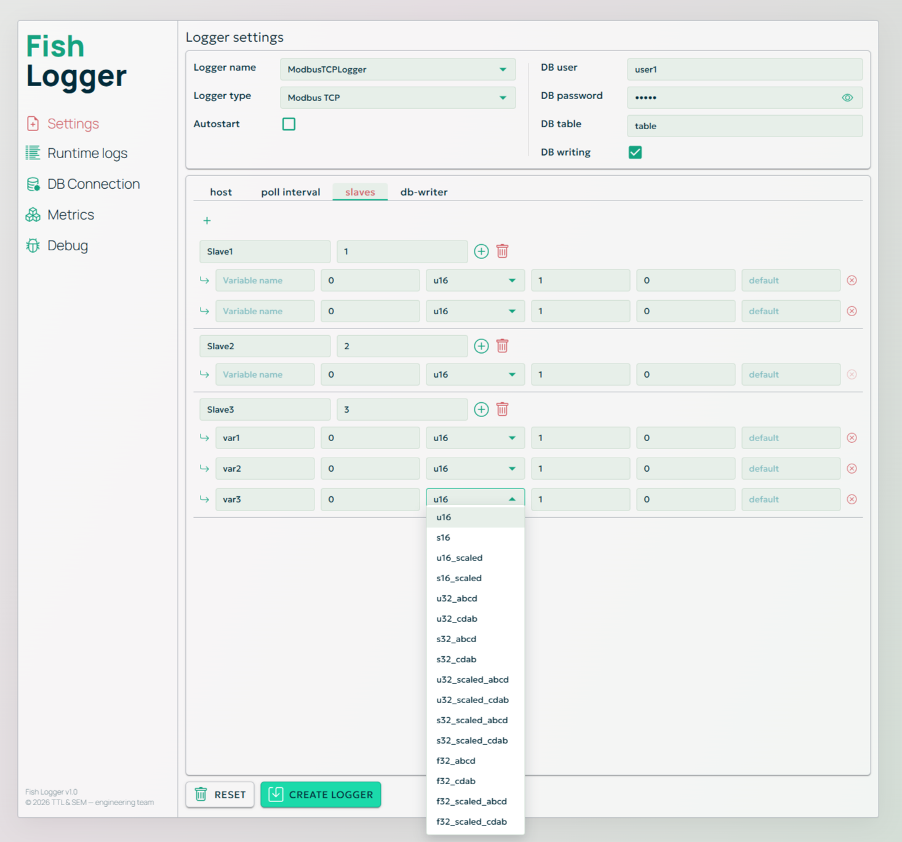

# ULogger

ULogger is a technical application for configuring, running, and monitoring industrial data loggers.
It combines a backend runtime service and a web-based frontend into a single desktop application distributed as a ready-to-run `.exe`.

The system is designed for engineers and integrators who need a practical tool to work with real devices:
serial lines, Modbus networks, TCP/IP connections, and proprietary hardware interfaces.

The focus of the project is clarity, control, and observability — without unnecessary abstraction or hidden automation.

---

## Screenshots

### Logger configuration (Modbus TCP)



The interface focuses on explicit configuration and clear data flow:
logger parameters, protocol-specific settings, database mapping, and runtime options are visible and editable in one place.

---

## System Concept

ULogger consists of two tightly connected parts:

- **Backend** — a runtime service responsible for device communication, data processing, and persistence.
- **Frontend** — a single-page web interface used for configuration, monitoring, and debugging.

The backend exposes a structured HTTP API.
The frontend acts as a configuration and observability layer on top of this API.

Both parts share a common configuration model and terminology, which allows the system to remain predictable even as new logger types and features are added.

---

## Architecture Overview

At a high level, the system looks like this:

```
┌────────────┐
│  Frontend  │  Web UI (SPA)
└─────┬──────┘
      │ HTTP API
┌─────▼──────┐
│  Backend   │  Runtime, loggers, data processing
└─────┬──────┘
      │
┌─────▼──────┐
│ Database   │  PostgreSQL
└────────────┘
      │
┌─────▼──────┐
│  Devices   │  Serial / Modbus / TCP / Custom
└────────────┘
```

Each logger runs as an isolated runtime unit with its own configuration and state, while sharing a common lifecycle and management model.

---

## Application Format

ULogger is distributed as a **desktop application**.

- The backend and frontend are bundled together
- No separate server setup is required for end users
- The application is started via a single `.exe` file

This makes ULogger suitable for use on engineering workstations, test benches, and industrial PCs.

---

## Quick Start

### Run the Application

1. Open the `builds/` directory
2. Extract the application archive
3. Run the provided `.exe` file
4. Open the web interface using the address shown in the application console (typically `http://localhost`)

No additional installation steps are required.

---

## Repository Structure

```
ULogger/
├── backend/     # Backend source code
├── frontend/    # Frontend source code
├── builds/      # Ready-to-run application builds (.exe archives)
├── misc/        # Miscellaneous files and resources
├── README.md
└── LICENSE
```

Each major component contains its own README with implementation and development details.

---

## Intended Use

ULogger is intended for:

- industrial and laboratory environments
- device integration and testing
- long-running data acquisition tasks
- situations where visibility into runtime state and raw data matters

It is not a consumer-facing product and does not attempt to hide technical details from the user.

---

## Project Status

The project is under active development.

The architecture is stable, while new logger types, configuration options, and UI improvements are added incrementally.

---

## License

ULogger is free and open-source software.

Copyright © 2025  
**TTL & SEM Engineering Team**
Original author: TTL & SEM Engineering Team

Licensed under the **GNU General Public License v3.0 (GPL-3.0)**.  
See the `LICENSE` file for full license text.
